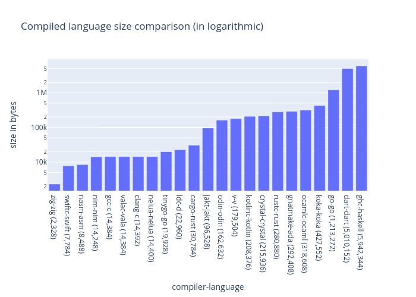

Compare size of compiled languages.

### Chart

Linear chart:

Logarithmic chart:

### Table

| compiler - language | version \* | size (in bytes) |
| ------------------- | ---------- | --------------- |
| zig-zig             |            | 2,328           |
| swiftc-swift        |            | 7,784           |
| nasm-asm            |            | 8,488           |
| nim-nim             |            | 14,248          |
| valac-vala          |            | 14,384          |
| gcc-c               |            | 14,384          |
| clang-c             |            | 14,392          |
| nelua-nelua         |            | 14,400          |
| tinygo-go           |            | 19,928          |
| ldc-d               |            | 22,960          |
| cargo-rust          |            | 30,784          |
| jakt-jakt           |            | 96,528          |
| odin-odin           |            | 162,632         |
| v-v                 |            | 179,504         |
| kotlinc-kotlin      |            | 208,376         |
| crystal-crystal     |            | 215,936         |
| rustc-rust          |            | 280,880         |
| gnatmake-ada        |            | 292,408         |
| ocamlc-ocaml        |            | 318,608         |
| koka-koka           |            | 427,552         |
| go-go               |            | 1,213,272       |
| dart-dart           |            | 5,010,152       |
| ghc-haskell         |            | 5,942,344       |

\* TODO: add compiler version.\
