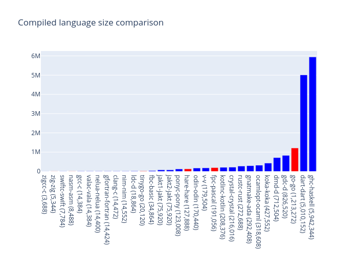
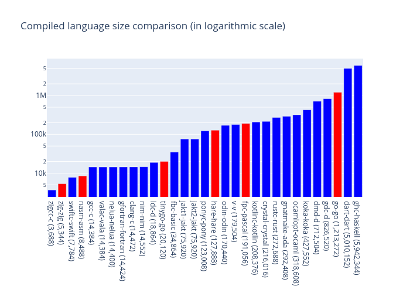

<!--
This file is auto-generate using scripts/generate_readme.py
Do not change manually
-->

Compare size of compiled languages.

### Chart

Linear scale:

Logarithmic scale:

### Table

| language | compiler | version | linking | size (in bytes) |
| -------- | -------- | ------- | ------- | --------------- |
|c|zigcc|clang version 15.0.3 (git@github.com:ziglang/zig-bootstrap.git 0ce789d0f7a4d89fdc4d9571209b6874d3e260c9)|dynamically linked|3,688|
|zig|zig|0.10.0-dev.4707+209a0d2a8|statically linked|5,344|
|swift|swiftc|Swift version 5.6 (swift-5.6-RELEASE)|dynamically linked|7,784|
|asm|nasm|NASM version 2.15.05 compiled on Sep 24 2020|statically linked|8,488|
|c|gcc|gcc (GCC) 12.2.0|dynamically linked|14,384|
|vala|valac|Vala 0.56.3|dynamically linked|14,384|
|nelua|nelua|Nelua 0.2.0-dev|dynamically linked|14,400|
|fortran|gfortran|GNU Fortran (GCC) 12.2.0|dynamically linked|14,424|
|c|clang|clang version 14.0.6|dynamically linked|14,472|
|nim|nim|Nim Compiler Version 1.6.8 [Linux: amd64]|dynamically linked|14,552|
|d|ldc|LDC - the LLVM D compiler (1.30.0):|dynamically linked|18,864|
|go|tinygo|tinygo version 0.26.0 linux/amd64 (using go version go1.19.2 and LLVM version 14.0.0)|statically linked|20,120|
|basic|fbc|FreeBASIC Compiler - Version 1.09.0 (2022-02-16), built for linux-x86_64 (64bit)|dynamically linked|34,864|
|jakt|jakt1|None|dynamically linked|75,920|
|jakt|jakt2|None|dynamically linked|75,920|
|pony|ponyc|0.43.1- [release]|dynamically linked|123,008|
|hare|hare|Hare dev+b00d4a6f-arch|statically linked|127,888|
|odin|odin|odin version dev-2022-10:2cd895c5|dynamically linked|170,440|
|v|v|V 0.3.1 f2f6ea5|dynamically linked|179,504|
|pascal|fpc|Free Pascal Compiler version 3.2.2 [2022/08/31] for x86_64|statically linked|191,056|
|kotlin|kotlinc|Kotlin/Native: 1.7.10|dynamically linked|208,376|
|crystal|crystal|Crystal 1.6.1 (2022-10-24)|dynamically linked|216,016|
|rust|rustc|rustc 1.66.0-nightly (db0597f56 2022-10-11)|dynamically linked|272,688|
|ada|gnatmake|GNATMAKE 12.2.0|dynamically linked|292,408|
|ocaml|ocamlopt|4.14.0|dynamically linked|318,608|
|koka|koka|Koka 2.3.8, 10:27:37 Dec 27 2021 (ghc release version)|dynamically linked|427,552|
|d|dmd|DMD64 D Compiler v2.100.2|dynamically linked|712,504|
|d|gdc|gdc (GCC) 12.2.0|dynamically linked|826,520|
|go|go|go version go1.19.2 linux/amd64|statically linked|1,213,272|
|dart|dart|Dart SDK version: 2.18.3 (stable) (Mon Oct 17 13:23:20 2022 +0000) on "linux_x64"|dynamically linked|5,010,152|
|haskell|ghc|The Glorious Glasgow Haskell Compilation System, version 9.0.2|dynamically linked|5,942,344|